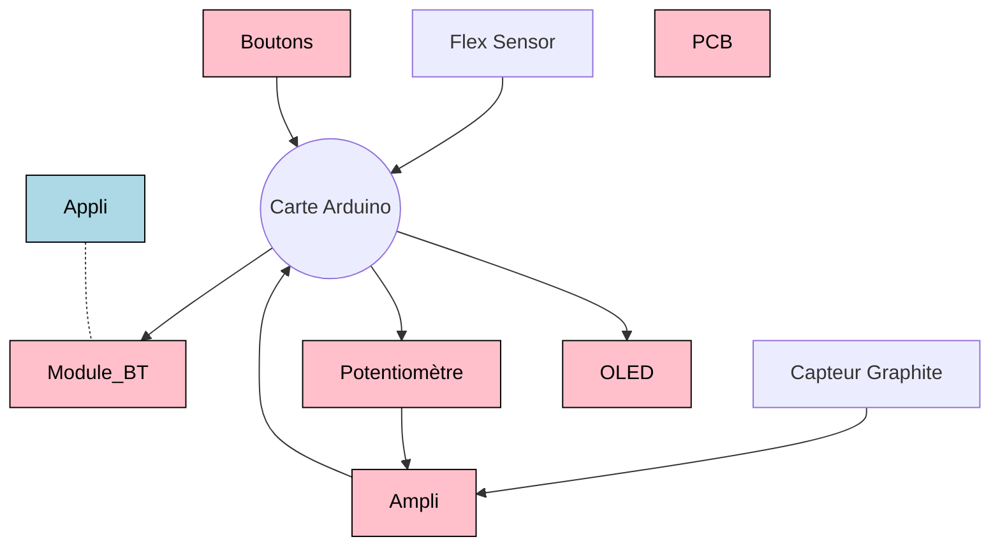

# 2023-2024-4GP-BriereRome-Clair
Projet Capteur de Jules et Gabriel 
# Projet Capteur
## Contexte  
Nous avons rélaié ce projet dans le carde de notre cours de MOSH à l'INSA Toulouse en 4A au sein du Génie Physique.  
L'objectif de ce projet est de tester les caractéristiques d'un capteur en graphique.  

# 1. Presentation Générale
Voici ci-dessus un petit schéma de notre projet. comprenant chacune des parties differentes de notre projet.  

Afin de mesurer la flexion de notre capteur graphite nous mesurons sa resistance. Cependant, sa resitance etant très grande, le signal est très faible. Ainsi, nous utilisons un ampli pour augmenter le signal. Nous utilisons ensuite un arduino pour recolter et transmettre les données que nous lisons sur une application. Nous avons aussi des boutons et un afficheur LED afin de changer la valeur du potententiometre qui module le gain de l'ampli.  

# 2. L'electronique analogique
Notre capteur est un capteur à resistance variable. Ainsi, pour lire la valeur de la resistance, nous utilisons un pont diviseur de tension. 
    Cependnat, le signal obtenu est très faible. Pour l'amplifier, nous utilisons un montage... 
    Gabriel c'est ta partie

# 3. KiCad : [ici pour les docs](https://github.com/MOSH-Insa-Toulouse/2023-2024-4GP-BriereRome-Clair/tree/main/Shield)
Nous avons réalisé un PCB en utilisant l'application Kicad8. Pour ce faire, nous avons repris le schéma éléctrique decrit ci-dessus.  
    Nous avons créé la plupart des emprintes pour les rajouter au PCB. 
    Une fois le document complété, nous avons imprimé le PCB et avons soudé chacun des composants.  
     
   Partie Schématique:  
     
    
   Partie PCB :  
     

# 4. L'Arduino : [ici pour le code](lien)
Gabi c'est aussi pour toi

# 5. L'Application
Afin de communiquer avec l'adruino, nous avons créé une application en utilisant "MIT app inventor".
## Présentation générale
Notre application comporte :  
* 2 graphiques :
    * 1 pour le capteur graphite
    * 1 pour le flex sensor
* 2 afficheurs numériques avec des valeurs en 0 et 255
  * 1 pour le capteur graphite
  * 1 pour le flex sensor
* 1 bouton de sélection Bluetooth
* 1 bouton de reset pour les graphiques
   
    
     
## Partie 1 : Sélection du périphérique Bluetooth

