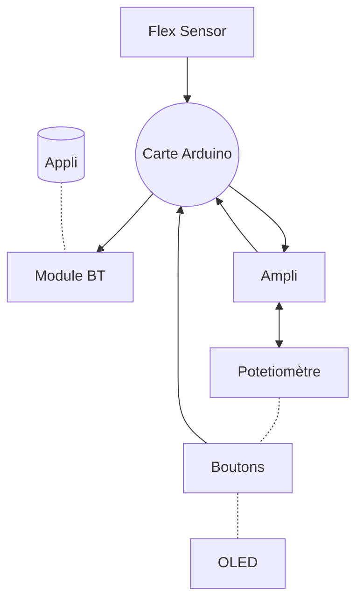

# 2023-2024-4GP-BriereRome-Clair
Projet Capteur de Jules et Gabriel 
### Projet Capteur

## Le projet

### Contexte  
Nous avons rélaié ce projet dans le carde de notre cours de MOSH à l'INSA Toulouse en 4A au sein du Génie Physique.  
### Contact  
Jules: jules.briere-rome@insa-toulouse.fr  
Gabriel: clair@insa-toulouse.fr

### Table des matières
## Nous avons séparé notre travail en plusieurs parties: 
[Le Kicad](

