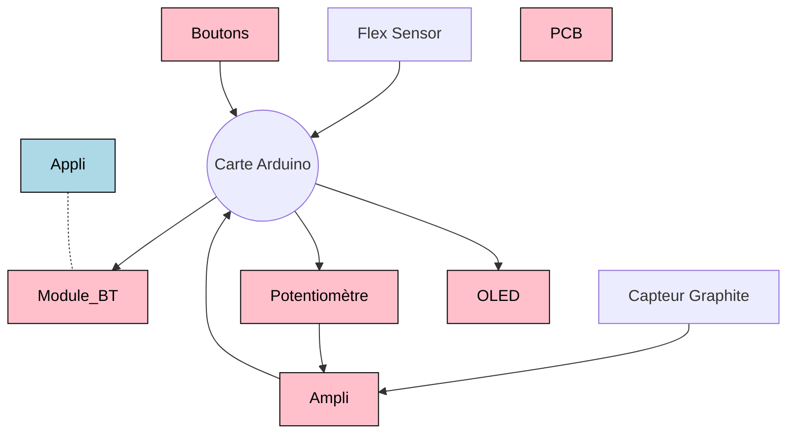

# 2023-2024-4GP-BriereRome-Clair
Projet Capteur de Jules et Gabriel 
# Projet Capteur
## Contexte  
Nous avons rélalisé ce projet dans le cadre de notre cours de MOSH à l'INSA Toulouse en 4A au sein du Génie Physique.  
L'objectif de ce projet est de tester les caractéristiques d'un capteur en graphite.  
## Somaire
### [1. Présentation Générale](#pg)
### [2. L'électronique analogique](#ea)
### [3. KiCad](KiCad)
### [4. L'Arduino](#dudu)
### [5. L'Application](#app)
### [6. Résultats](#res)

# 1. Présentation Générale <a name="pg">
Voici ci-dessus un petit schéma de notre projet. comprenant chacune des parties differentes de notre projet.  

Afin de mesurer la flexion de notre capteur graphite nous mesurons sa resistance. Cependant, sa resitance etant très grande, le signal est très faible. Ainsi, nous utilisons un ampli pour augmenter le signal. Nous utilisons ensuite un arduino pour récolter et transmettre les données que nous lisons sur une application. Nous avons aussi des boutons et un afficheur LED afin de changer la valeur du potententiometre qui module le gain de l'ampli.  

# 2. L'electronique analogique <a name="ea">
Notre capteur est un capteur à resistance variable. Ainsi, pour lire la valeur de la resistance, nous utilisons un pont diviseur de tension. 
    Cependnat, le signal obtenu est très faible. Pour l'amplifier, nous utilisons un Amplificateur transimpédence 
    La résistance du capteur varie en fonction de sa déformation. On impose une tension à ses bornes et on détecte donc une variation de courrant. On fait passer ce courrant dans une résistance de shunt vers la masse, la tension au borne de cette résistance de shunt varie donc avec la déformation du capteur. C'est cette tension que l'on va amplifier. 

# 3. KiCad : [ici pour les docs](https://github.com/MOSH-Insa-Toulouse/2023-2024-4GP-BriereRome-Clair/tree/main/Shield) <a name="KiCad">
Nous avons réalisé un PCB en utilisant l'application Kicad8. Pour ce faire, nous avons repris le schéma éléctrique decrit ci-dessus.  
Nos contraintes etaient les suivantes:
* Largeur de la piste : 0,5 mm minimum
* Isolation des pistes : 0.5mm minimum
* Bluetooth, OLED, Connecteurs (header) : pad à 1mm de diamètre, ovale 2*2.54mm
* Résistance, condensateur, support AOP : Pad à 0.8mm de diamètre, Cercle 2.54mm
* Support AOP, Pot Digital : pad n°1 rectangulaire, les autres ovales ou ronds

Nous avons créé la plupart des emprintes pour les rajouter au PCB. Elles sont disponibles dans nos fichiers.  
Une fois le document complété, nous avons imprimé le PCB et avons soudé chacun des composants.  
     
   Partie Schématique:  
     
    
   Partie PCB :  
     

# 4. L'Arduino : [ici pour le code](https://github.com/MOSH-Insa-Toulouse/2023-2024-4GP-BriereRome-Clair/blob/main/Projet_capt.ino) <a name="dudu">
## Présentation générale
Le programme Arduino permet de réaliser 4 fonctions :
* ***Régalage*** du calibre de l'amplificateur avec **3 boutons**
* ***Affichage*** du choix sur un **ecran OLED**
* ***Acquisition*** des mesurese du **flex sensor**
* ***Communication*** vers une appli Android via **bluetooth**
Le code est modulaire, chaque fonctionnalité est assurée par une fonction indépendante.

## Détail sur les bouton
On utilise 3 boutons (+, - et ok) pour choisir la valeur du gain. La boucle générale met assez de temps à s'exécuter pour ne pas avopir à gérer le débouncing des boutons. On a aussi implémenter un timer qui permet que la valeur de change pas trop vite en cas d'appuie long.
Le code utilise 2 variables (valeur séléctionnée et valeur validée)

## Détail sur l'écran
Nous avons utilisé très simplement la librairie ecranOLED

## Détail sur le potentiomètre numérique
Ce composant communique avec le protocole SPI, nous avons donc utilisé la librairie SPI.

## Détail sur l'acquisition des données
Nous avons fait une lecture analogique sur les entrée puis utilisé mpa pour que les données soient transférable via le module bluetooth.

## Détail sur la communication
Nous avons écrit les données sur un port série relié au module bluetooth

# 5. L'Application <a name="app">
Afin de communiquer avec l'adruino, nous avons créé une application en utilisant "MIT app inventor".
## Présentation générale
Notre application comporte :  
* 2 graphiques :
    * 1 pour le capteur graphite
    * 1 pour le flex sensor
* 2 afficheurs numériques avec des valeurs en 0 et 255
  * 1 pour le capteur graphite
  * 1 pour le flex sensor
* 1 bouton de sélection Bluetooth
* 1 bouton de reset pour les graphiques
   
    
     
## Partie 1 : Sélection du périphérique Bluetooth
En cliquant sur le bouton "select bluetooth", vous pouvez ouvrir une liste deroulante et selectionner le bluetooth dont vous avez besoin.
  
 
## Partie 2 : Reception des données
Le fait de selectionner un Bluetooth déclenche une cloque qui va sequencer la reception de données.  
La boucle de la cloque verifie si des données sont disponibles. Si il y en a, elle met chacune des deux valeurs (Flex sensor et capteur graphite) dans une variable.  
 

## Partie 3 : Affichage graphique
Afin de rendre les données facilment lisisbles, nous avons décidé d'utiliser des graphiques. Pour cela nous avons utilisé les chart2D.  
Afin de recentrer automatiquement le graphique, nous attendons d'avoir le bon nombre de mesures et utilisons ensuite la fonction SetDomain pour décaler le graphique. Le bouton reset permet de remettre l'echelle à 0.
 

# 6. Résultats et banc de teest <a name="res">
### Objectifs
Nous avons monté un banc de test afin d'etudier l'influence du type de crayon utilisé sur les performances du capteur et regarder la variation de résistance.  
### Méthode
Pour cela nous avons utilisé des cercles de diamètre diffeernent et avons exprimé la variation de résistance en fonction de la deformation.  
  
### Résultats
Nous avons obtenu les courbes ci-dessous. Nous observons que la variation est lineaire et que le type de crayon a une forte influence. Les crayons plus durs ("hard") semblent avoir une plus grande sensibilité que les crayons doux.  
  

